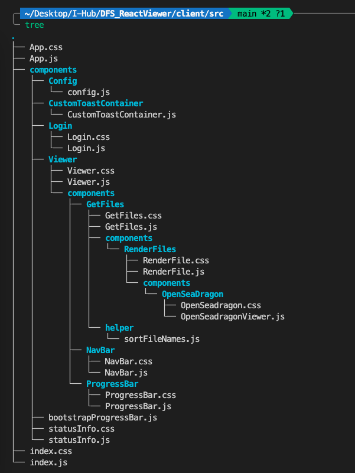
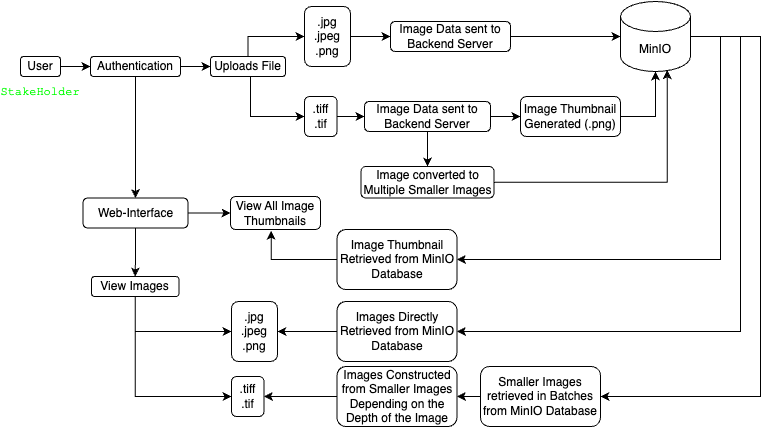

# Client
- This Repository Refers to the Frontend of the Web-App
- In `client/` Run the Following Command to Install the Dependencies
```
npm install --no-lockfile --legacy-peer-deps
```
---


### Running the Frontend
```
npm start
```
---

### Directory Structure

---

### HV Upload Pipeline

- The User can Upload `.tiff` `.tif` `.png` `.jpeg` `.jpg` files to the HV Platform.

### Storing the Images in MinIO Database
- The `.png` `.jpeg` `.jpg` files are directly stored in the MinIO Database without any processing done on them.
- The `.tiff` `.tif` files are broken down into Batches of Smaller Images which are then stored into the MinIO Database.

### Accessing the Thumbnails of Images
- The `.png` `.jpeg` `.jpg` files are directly accessed from the MinIO Database.
- For the `.tiff` `.tif` files, the Smaller Images are retrieved in Batches which are then Reconstructed in the Frontend and Displayed to the User. The Images are Continously Retireved and Constructed as per the Depth of the Image.
---

